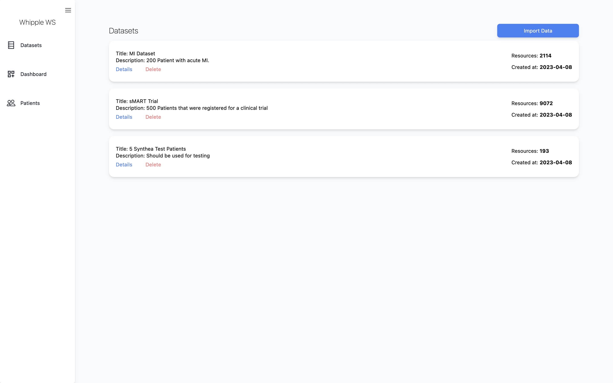
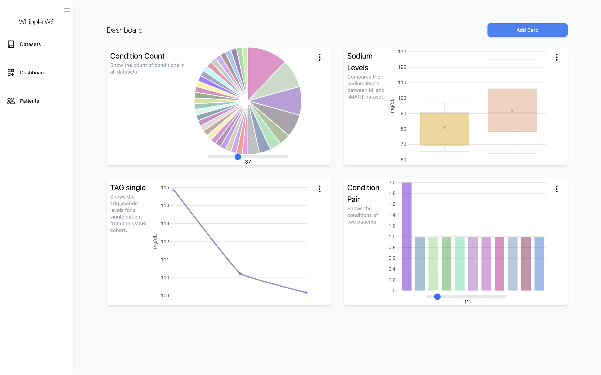
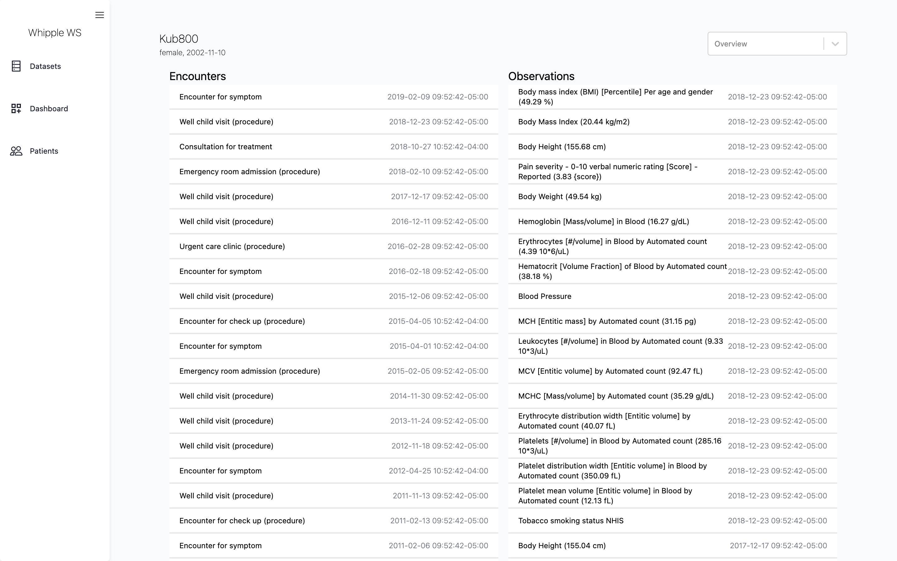
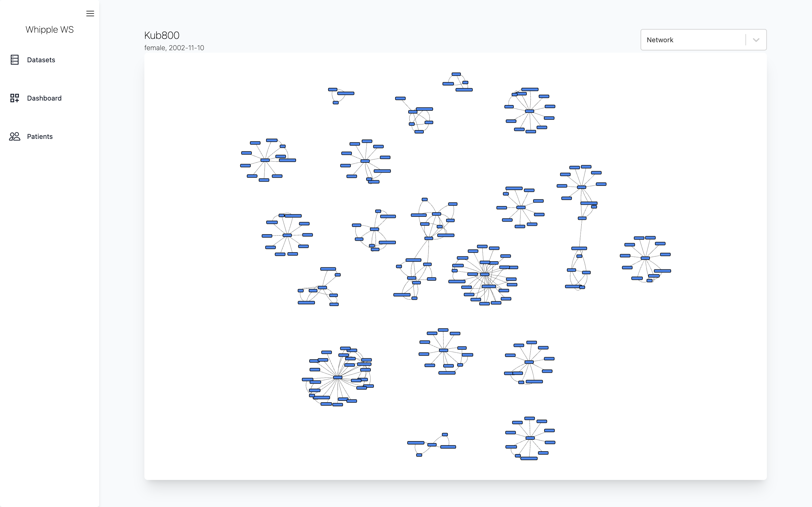
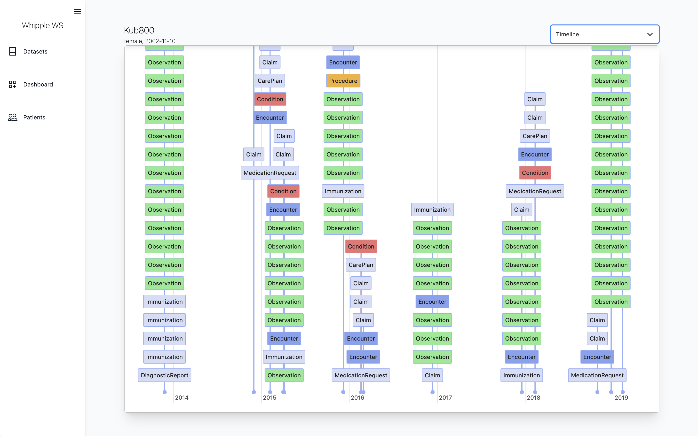

# Whipple

**This project is under development**

Whipple is a project that provides introspection into FHIR data. It allows you to explore and analyze FHIR data in a user-friendly way, giving you insight into the structure and content of the data.

## Getting started ([Docker](https://www.docker.com/))

Clone the project into a local directory using:

```shell
git clone https://github.com/trostalski/whipple.git
cd whipple
```

Make sure you have Docker installed and running, then execute the following command in the root directory to spin up all docker containers:

```shell
docker-compose up
```

The interface should now be available at [http://localhost:3000](http://localhost:3000)

## Features

- Load datasets into Whipple


- Visualize key characterisitcs of datasets or individual patients in a dashboard


- Inspect a patient resource and its connections to other resources in an overview, network or timeline




## Build

**backend**:

Start the postgres database inside a docker container by running:

```shell
docker-compose -f docker/compose-postgres.yml up
```

Navigate to the [server directory](./whipple/server) and and create a virtual environment. Activate the environment and install the dependenices from the `requirements.txt`.

Move to the `src` directory and start the [fast-api](https://fastapi.tiangolo.com/) backend:

```shell
uvicorn app.main:main --host 0.0.0.0 --port 8000 --reload
```

**frontend**:

Navigate to the [client](./whipple/client) directory.

Install the dependencies:

```shell
npm install
```

Start the [React](https://react.dev/) frontend:

```shell
npm run start
```

## Contributing

Contributions of all kinds are welcome.
